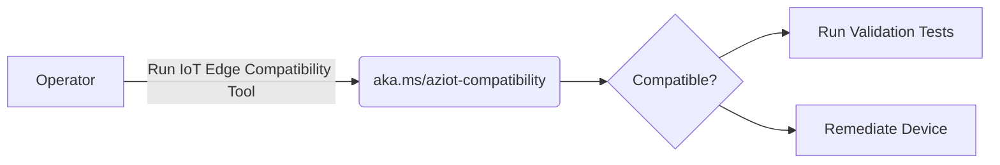
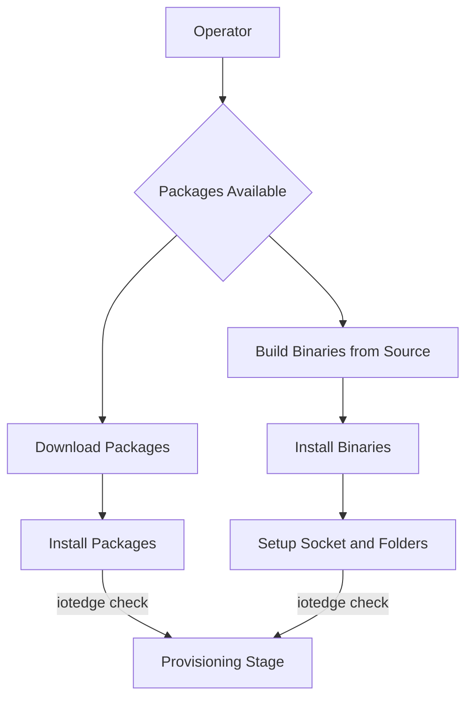
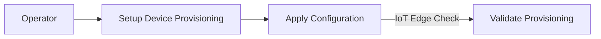

## *Platform Validation Toolkit*

The document describes the checks run by IoT Edge Platform Compatibility Toolkit in 3 different stages

### *Compatibility Stage*



These are checks that would run as part of [Azure IoT Compatibility Script](platform-validation/scripts/aziot-compatibility.sh) to determine whether or not IoT Edge can run on the device

Example Usage
```sh
wget aka.ms/aziot-compat.sh | sh
```
1. Check if CGroups Heirarchy is present - IMPLEMENTED
2. Check if Required Kernel Configuration for Running IoT Edge is Present - IMPLEMENTED
3. Check if systemd is present - IMPLEMENTED
4. Check if Architecture is supported - IMPLEMENTED
5. Check if Docker API Version is supported - IMPLEMENTED
6. Check if Shared Library Dependencies are met - IMPLEMENTED
7. Check if enough Memory is available on the device to run iot edge with minimal workload - IMPLEMENTED
8. Check if enough storage space is available on the device to run iot edge with minimal workload - IMPLEMENTED
9. Ensure that we can create a docker network(If Docker is present) - NOT IMPLEMENTED


### *Installation/Pre-Provisioning Stage*



These are checks that would run after a user has installed/upgraded iot edge binaries/package on the device. 

```sh
iotedge check --validate-install
```

1. Do I/O Read Write Operation : These Tests would involve exercising std::fs functions
2. Create/Open/Close Sockets
3. CURL calls to workload/management/identity/keyd/certd sockets to ensure they respond. Is there a generic call we can make to the sockets?
4. Exercise sysinfo crate function calls to make sure they work


### *Provisioning Stage*


These are checks that would run after the user has setup device provisioning information in config.toml 

1. If PKCS#11 Path Provided, verify if PKCS#11 Path configured properly. Required pkcs-11 tool ? 
2. If Edge-CA Cerficicates and Key Provided, Ensure CA-Cert dir is owned by aziotcs and Key is owned by aziotks
3. Ensure Docker Logs are Available via iotedge logs edgeAgent
4. TPM Related Checks